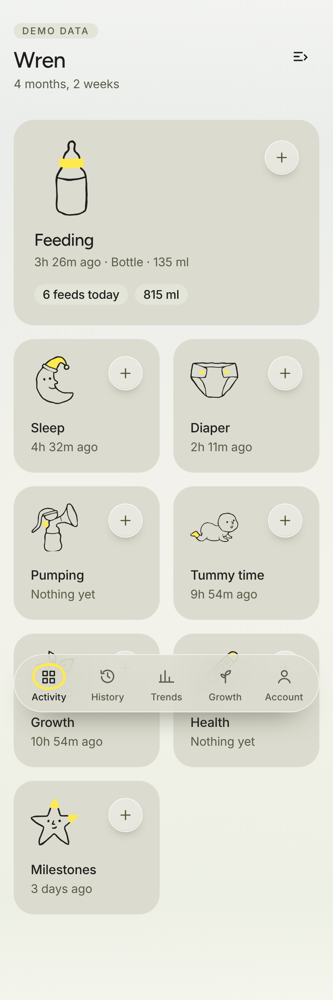

# Gaia app demo

A browser prototype of the Gaia baby log, built entirely from the `gaia-brand` skill. It's a working example of what the skill gives you and how its rules apply to app UI.

**Demo data only.** The child "Wren" and every record are synthetic, generated on first load and kept in this browser's `localStorage`. This is not the Gaia app and doesn't talk to any service.

## Run it

The page fetches the skill's JSON assets, so serve it over HTTP rather than opening the file directly:

```sh
cd plugins/gaia-brand
python3 -m http.server 8765
# open http://localhost:8765/demo/
```

No build step and no dependencies.

## What it consumes from the skill

| Skill asset | Used for |
| --- | --- |
| `assets/gaia.css` | Light/dark color roles, the graded ground, Figtree and Inter font faces, spacing variables |
| `assets/illustrations.json` | Drawings inlined as SVG, so the ink follows the theme (accent painted first, ink above) |
| `assets/manifest.json` | Activity → drawing mapping (feeding → bottle, sleep → moon, …) |
| `assets/gaia-wordmark*.svg` | Wordmark on the Account screen, light or dark version |
| `references/*.md` | Type roles, layout sizes, motion durations and curves, and copy, applied in `app.css` and `app.js` |

## Screens

- **Activity**: header with the child's name and age; a featured activity (choose it with the edit-layout button) and a two-column grid. Each card has a glass add control that opens a bottom sheet for logging. Sleep runs a real timer with tabular numerals.
- **History**: "The whole day, in order." Newest first, with day stepping and a factual empty state.
- **Trends**: "Patterns without targets." Single-series bars (chart mark on chart track) for feeds and daytime naps, with no scores or goals.
- **Growth**: "Measurements in context." The child's own weight line. WHO percentiles are deliberately left out instead of being hand-drawn.
- **Account**: theme (System/Light/Dark) and reduce-motion (System/On/Off) settings, plus a reset for the demo data.

The floating pill tab bar marks the selected tab with a drawn yellow ring (a 620 ms pen gesture). Press scales, sheet timing and reduced motion follow the skill's motion tokens.

## Rights

The demo code follows the skill's MIT terms for helper code. Gaia's logos, illustrations and tokens remain reserved. See [`../LICENSE.md`](../LICENSE.md).


